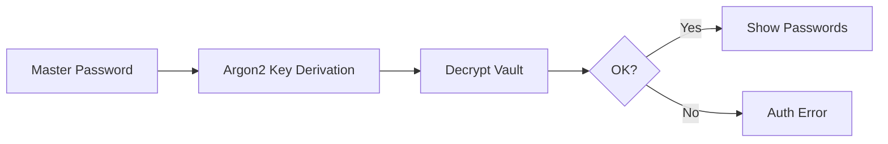

# 📘 Hướng dẫn Quản lý Tài liệu Dự án Vaultrs

> **Mục tiêu:** Quy định cách Developer tương tác với tài liệu dự án một cách hiệu quả và nhất quán.

---

## 📋 TL;DR - Checklist Nhanh

| Thời điểm         | Hành động                                          |
| ----------------- | -------------------------------------------------- |
| 🌅 Trước khi code | Đọc `01-architecture/`                             |
| 💡 Có ý tưởng mới | Ghi vào `99-dev-notes/idea.md` với status `[TODO]` |
| 📅 Cuối tuần      | Review và cập nhật status trong `idea.md`          |
| 🚀 Mỗi `git push` | Kiểm tra & cập nhật docs liên quan                 |

---

## 1. ✍️ Quy trình Viết Tài liệu

### Bước 1: Xác định Mục đích

Trước khi tạo file, tự hỏi: _"File này dành cho ai và để làm gì?"_

| Loại      | Mục đích                    | Thư mục              |
| --------- | --------------------------- | -------------------- |
| Kiến trúc | Tổng quan thiết kế hệ thống | `01-architecture/`   |
| Database  | Schema, quan hệ dữ liệu     | `02-database/`       |
| Backend   | API specs, crypto logic     | `03-backend-rust/`   |
| Frontend  | Components, UI flows        | `04-frontend-react/` |
| Ghi chép  | Ý tưởng, debug notes        | `99-dev-notes/`      |

### Bước 2: Dùng Mermaid cho Sơ đồ

Ưu tiên **Mermaid.js** để sơ đồ có thể chỉnh sửa trực tiếp trong Markdown.

Ví dụ:



### Bước 3: Liên kết Tài liệu

Không để docs đứng cô lập:

-   **Obsidian:** `[[Tên file]]`
-   **Markdown:** `[Mô tả](../path/to/file.md)`

---

## 2. 📖 Cách Đọc Tài liệu

| Ngữ cảnh            | Đọc                    |
| ------------------- | ---------------------- |
| Trước khi code      | `01-architecture/`     |
| Làm crypto/security | `03-backend-rust/`     |
| Làm UI              | `04-frontend-react/`   |
| Weekly review       | `99-dev-notes/idea.md` |

**Quy trình Weekly Review:**

```
99-dev-notes/idea.md
    ├── ✅ Khả thi → Đổi status sang [TODO]
    ├── 🚧 Đang làm → Giữ [IN_PROGRESS]
    ├── ✔️ Xong → Đổi sang [DONE]
    └── ❌ Không cần → Đổi sang [ARCHIVED]
```

---

## 3. 💡 Ghi chép Ý tưởng

### Template ghi ý tưởng

Ghi vào `99-dev-notes/idea.md` theo format:

```markdown
## [STATUS] Tên ý tưởng

-   **Ngày tạo:** YYYY-MM-DD
-   **Vấn đề:** [Tại sao cần?]
-   **Trade-off:** [Chi phí/ảnh hưởng?]
-   **Loại:** Security | UI/UX | Core | Add-on
-   **Ưu tiên:** Cao | Trung bình | Thấp
-   **Trạng thái:** TODO | IN_PROGRESS | DONE | ARCHIVED
-   **Ngày hoàn thành:** YYYY-MM-DD (nếu DONE)
```

### Quản lý trạng thái

| Status          | Ý nghĩa      | Khi nào cập nhật            |
| --------------- | ------------ | --------------------------- |
| `[TODO]`        | Chưa bắt đầu | Ý tưởng mới được chấp nhận  |
| `[IN_PROGRESS]` | Đang làm     | Khi bắt đầu code/implement  |
| `[DONE]`        | Hoàn thành   | Khi merge PR vào main       |
| `[ARCHIVED]`    | Lưu trữ      | Không làm nữa/không khả thi |

**Workflow cập nhật:**

```
Ý tưởng mới
    ↓
[TODO] Chờ implement
    ↓ (git checkout -b feature/...)
[IN_PROGRESS] Đang code
    ↓ (git merge)
[DONE] Hoàn thành ✅
    ↓ (sau 1 tháng)
Xóa hoặc archive
```

### Phân loại ý tưởng

| Tag        | Mô tả         | Ví dụ                |
| ---------- | ------------- | -------------------- |
| `Security` | Bảo mật       | 2FA, encryption      |
| `UI/UX`    | Giao diện     | Dark mode, shortcuts |
| `Core`     | Logic lõi     | Sync, vault format   |
| `Add-on`   | Tính năng phụ | Browser extension    |

> ⚠️ **Lưu ý:** Ý tưởng `Security` phải review kỹ trước khi triển khai.

### Ví dụ thực tế

```markdown
## [DONE] Thêm Dark Mode

-   **Ngày tạo:** 2025-12-01
-   **Vấn đề:** User muốn UI tối để dễ nhìn ban đêm
-   **Trade-off:** ~2 ngày dev, test contrast
-   **Loại:** UI/UX
-   **Ưu tiên:** Trung bình
-   **Trạng thái:** DONE
-   **Ngày hoàn thành:** 2025-12-15

## [IN_PROGRESS] Implement 2FA với TOTP

-   **Ngày tạo:** 2025-12-10
-   **Vấn đề:** Tăng bảo mật tài khoản
-   **Trade-off:** ~5 ngày, cần security audit
-   **Loại:** Security
-   **Ưu tiên:** Cao
-   **Trạng thái:** IN_PROGRESS

## [TODO] Browser Extension

-   **Ngày tạo:** 2025-12-20
-   **Vấn đề:** Auto-fill password
-   **Trade-off:** ~2 tuần, học WebExtension API
-   **Loại:** Add-on
-   **Ưu tiên:** Thấp
-   **Trạng thái:** TODO
```

---

## 4. 🐛 Ghi chép Debug

Áp dụng **"5 Whys"** - hỏi "tại sao" cho đến nguyên nhân gốc:

```
❓ Decrypt fail? → Key sai
  ❓ Key sai? → Salt sai
    ❓ Salt sai? → Không đọc từ header
      ❓ Không đọc? → 🎯 KHÔNG ĐỌC DOCS FORMAT
```

**Template debug note:**

```markdown
## Bug: [Mô tả ngắn]

-   **Ngày:** YYYY-MM-DD
-   **Triệu chứng:** [Gì xảy ra?]
-   **Nguyên nhân:** [5 Whys result]
-   **Fix:** [Sửa thế nào?]
-   **Bài học:** [Rút ra gì?]
```

---

## 5. 🧹 Duy trì Ngăn nắp

-   [ ] File không còn giá trị → xóa hoặc `[ARCHIVED]`
-   [ ] Mỗi `git push` → kiểm tra docs liên quan
-   [ ] Sửa code → cập nhật docs tương ứng
-   [ ] Ý tưởng `[DONE]` quá 1 tháng → xóa khỏi `idea.md`

> 💀 Tài liệu lỗi thời **nguy hiểm hơn** không có tài liệu!

---

## 📂 Cấu trúc Thư mục

```
docs/
├── 00-meta/              # Meta docs (hướng dẫn viết docs)
├── 01-architecture/      # Kiến trúc hệ thống
├── 02-database/          # Database schema
├── 03-backend-rust/      # Backend API & crypto
├── 04-frontend-react/    # Frontend components
└── 99-dev-notes/         # Ghi chép dev
    └── idea.md           # File ý tưởng
```

---

## 🔗 Tài liệu Liên quan

-   [Cấu trúc thư mục](./1-folder-structure.md)
-   [Quy ước đặt tên](./2-naming-convention.md)

---

_Cập nhật: 2025-12-21_
