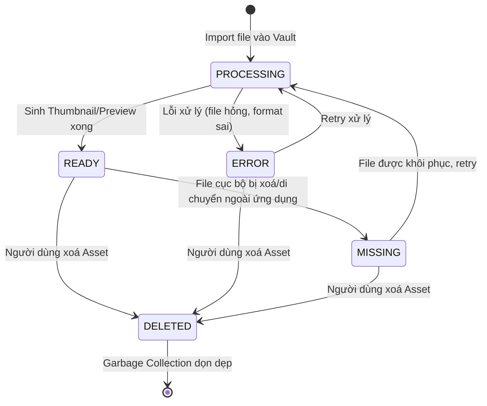
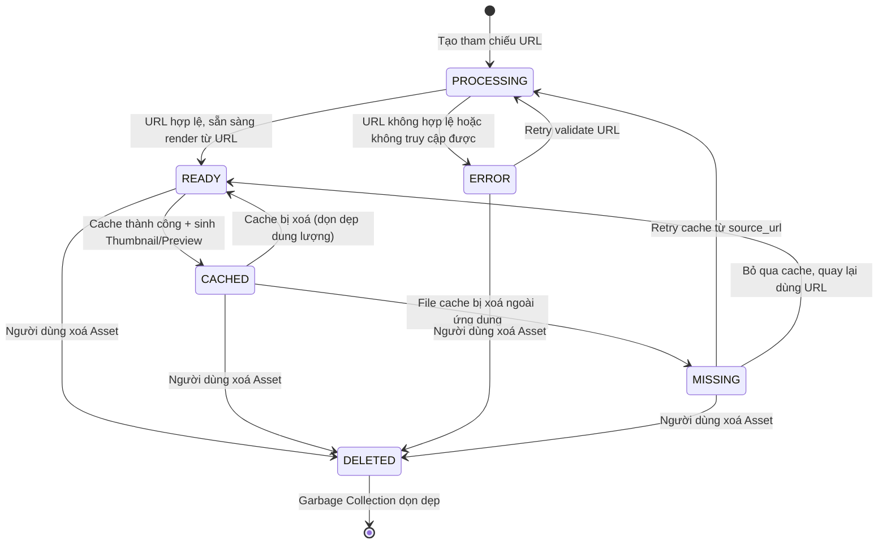
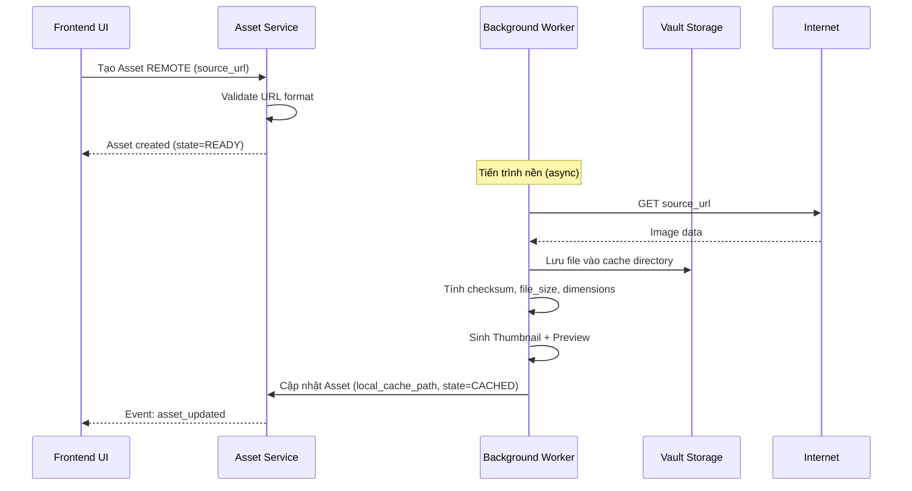
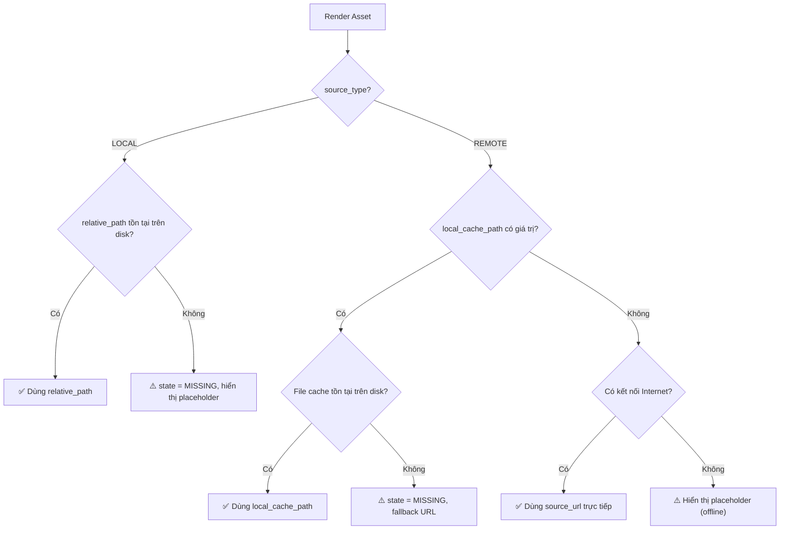
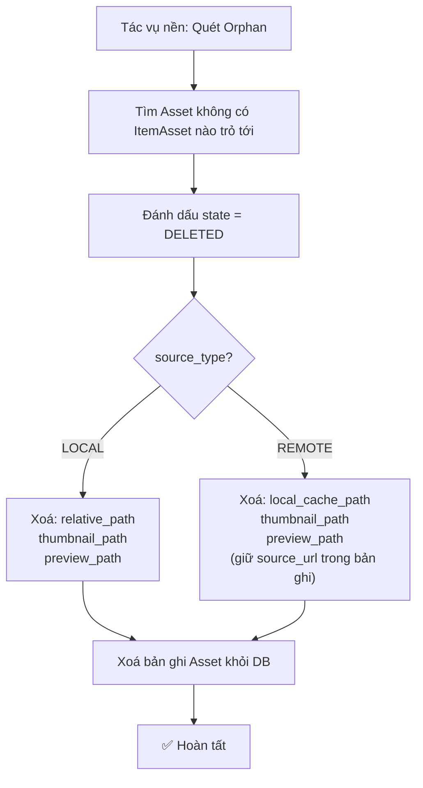

# 🔗 Kiến trúc Nguồn Asset (Asset Source Architecture)

> **Tài liệu bổ trợ cho:** [Đặc tả Thiết kế Database](./database-design-specification.md) — Section 2.5 Assets
>
> **Phạm vi:** Thiết kế chi tiết hệ thống dual-source (LOCAL/REMOTE) cho Assets, bao gồm cơ chế cache offline, vòng đời trạng thái, chiến lược lưu trữ và xử lý edge cases. Tài liệu này **không chứa SQL hay migration script**.

---

## 📋 TL;DR

| Khía cạnh          | Mô tả                                                                                              |
| ------------------ | -------------------------------------------------------------------------------------------------- |
| **Hai nguồn**      | `LOCAL` (file cục bộ trong Vault) và `REMOTE` (tham chiếu URL bên ngoài)                           |
| **Cache offline**   | Asset REMOTE có thể được tải về Vault Storage bất đồng bộ, phục vụ offline và tăng hiệu năng      |
| **Ưu tiên render** | File cục bộ > URL gốc > Placeholder                                                               |
| **Portable**       | Mọi đường dẫn cục bộ đều là đường dẫn tương đối — Vault có thể di chuyển giữa các máy              |
| **State machine**  | LOCAL: PROCESSING → READY; REMOTE: PROCESSING → READY → CACHED (tùy chọn)                         |

---

## 1. Bối cảnh & Motivation

### Vấn đề với thiết kế chỉ hỗ trợ Local

Thiết kế ban đầu của Vaultrs yêu cầu mọi Asset phải là **file vật lý đã import vào Vault Storage**. Điều này dẫn đến:

1. **Dung lượng phình nhanh:** Mỗi ảnh Cover (trung bình 200KB–2MB) phải copy vào Vault, dù nguồn gốc là URL có sẵn trên Internet (ví dụ: poster phim từ TMDB, bìa sách từ OpenLibrary).
2. **Không tận dụng được metadata crawler:** Khi crawler trả về URL ảnh, ứng dụng phải tải về → lưu file → tạo Asset — thêm latency và I/O không cần thiết cho thao tác import hàng loạt.
3. **Thiếu linh hoạt:** Người dùng muốn tham chiếu ảnh từ CDN hoặc nguồn bên ngoài mà không muốn copy toàn bộ vào ổ đĩa.

### Mục tiêu thiết kế

- Cho phép Asset **tham chiếu trực tiếp tới URL** mà không cần file cục bộ.
- Hỗ trợ **cache bất đồng bộ** từ URL về Vault Storage để phục vụ offline và tăng hiệu năng.
- Giữ nguyên tính **Portable** — mọi đường dẫn cục bộ vẫn là tương đối.
- Không thay đổi mô hình `Items → ItemAssets → Assets` — chỉ mở rộng nội tại bảng `Assets`.

---

## 2. Kiến trúc Source Type

### 2.1 Phân loại nguồn

Mỗi Asset bắt buộc có một `source_type` xác định nguồn gốc:

| source_type | Mô tả                                            | Ví dụ                                              |
| ----------- | ------------------------------------------------ | -------------------------------------------------- |
| `LOCAL`     | File đã import trực tiếp vào Vault Storage       | Ảnh người dùng kéo-thả từ máy tính                 |
| `REMOTE`    | Tham chiếu URL bên ngoài, có thể cache về Vault | Poster phim từ TMDB API, bìa sách từ OpenLibrary   |

### 2.2 Quy tắc bắt buộc/nullable theo source_type

| Trường            | LOCAL                                    | REMOTE                                           |
| ----------------- | ---------------------------------------- | ------------------------------------------------ |
| `source_type`     | ✔ `LOCAL`                                | ✔ `REMOTE`                                       |
| `source_url`      | Tuỳ chọn (lưu nguồn gốc nếu có)         | ✔ Bắt buộc                                       |
| `relative_path`   | ✔ Bắt buộc                               | `NULL` (chưa cache) hoặc tuỳ chọn                |
| `local_cache_path`| Không sử dụng (`NULL`)                   | `NULL` → có giá trị khi cache xong               |
| `file_size_bytes` | ✔ Bắt buộc (validate ở tầng ứng dụng)   | Nullable → có giá trị khi cache xong             |
| `checksum`        | ✔ Bắt buộc (validate ở tầng ứng dụng)   | Nullable → có giá trị khi cache xong             |
| `width` / `height`| Có giá trị (nếu là IMAGE)               | Nullable → có giá trị khi cache xong             |

> **Lưu ý:** Ràng buộc "bắt buộc có điều kiện" (ví dụ: `relative_path` bắt buộc khi `LOCAL`) được enforce ở **tầng ứng dụng** (Service Layer), không phải ở tầng database, vì SQLite không hỗ trợ CHECK constraint phức tạp theo giá trị cột khác một cách đáng tin cậy.

---

## 3. Vòng đời Trạng thái (State Machine)

### 3.1 Asset LOCAL



**Luồng điển hình LOCAL:**
1. Người dùng chọn file từ máy → File copy vào Vault Storage → Tạo bản ghi Asset với `state = PROCESSING`
2. Tiến trình nền sinh Thumbnail + Preview → Cập nhật `thumbnail_path`, `preview_path` → `state = READY`
3. Nếu lỗi xử lý → `state = ERROR`, ghi `error_message`

### 3.2 Asset REMOTE



**Luồng điển hình REMOTE:**
1. Crawler trả về URL ảnh → Tạo bản ghi Asset với `source_url`, `state = PROCESSING`
2. Validate URL (kiểm tra format, HEAD request nếu cần) → `state = READY`
3. (Tuỳ chọn, bất đồng bộ) Cache ảnh về Vault Storage → Sinh Thumbnail/Preview → `state = CACHED`

### 3.3 Bảng tổng hợp chuyển trạng thái

| Trạng thái hiện tại | Sự kiện                              | Trạng thái mới | Ghi chú                                   |
| -------------------- | ------------------------------------ | -------------- | ----------------------------------------- |
| —                    | Import file LOCAL                    | PROCESSING     | Tạo bản ghi mới                           |
| —                    | Tạo tham chiếu REMOTE               | PROCESSING     | Tạo bản ghi mới                           |
| PROCESSING           | Xử lý thành công (LOCAL)            | READY          | Thumbnail/Preview đã sinh                 |
| PROCESSING           | Validate URL thành công (REMOTE)    | READY          | Sẵn sàng render từ URL                    |
| PROCESSING           | Lỗi xử lý/validate                 | ERROR          | Ghi error_message                         |
| READY (REMOTE)       | Cache thành công                    | CACHED         | local_cache_path có giá trị               |
| CACHED               | Cache bị xoá có chủ đích            | READY          | Quay lại dùng URL, xoá local_cache_path   |
| CACHED               | File cache bị xoá ngoài ứng dụng   | MISSING        | Phát hiện qua integrity check             |
| READY (LOCAL)        | File gốc bị xoá ngoài ứng dụng     | MISSING        | Phát hiện qua integrity check             |
| ERROR                | Retry xử lý                         | PROCESSING     | Reset error_message                       |
| Bất kỳ               | Người dùng xoá Asset                | DELETED        | Chờ Garbage Collection                    |

---

## 4. Cơ chế Cache

### 4.1 Luồng cache bất đồng bộ



### 4.2 Chiến lược ưu tiên nguồn khi render

Khi UI cần hiển thị một Asset, tầng Service xác định nguồn theo thứ tự ưu tiên:



**Tóm tắt ưu tiên:**
1. File cục bộ (nhanh nhất, không phụ thuộc mạng)
2. URL gốc (cần Internet, có latency)
3. Placeholder (khi không thể truy cập bất kỳ nguồn nào)

### 4.3 Chính sách cache

| Chính sách                | Mô tả                                                                                       |
| ------------------------- | ------------------------------------------------------------------------------------------- |
| **Thời điểm cache**       | Bất đồng bộ sau khi tạo Asset REMOTE, hoặc theo yêu cầu người dùng                         |
| **Tự động cache**         | Có thể cấu hình trong CollectionSettings — cache tự động khi import hoặc chỉ khi yêu cầu    |
| **Xoá cache**             | Người dùng có thể xoá cache bất kỳ lúc nào — Asset chuyển về READY, tiếp tục dùng URL       |
| **Xoá cache hàng loạt**   | Tính năng dọn dẹp dung lượng — xoá cache của Asset REMOTE ít truy cập                       |
| **Cache lại**             | Khi cache bị xoá, hệ thống có thể cache lại bất kỳ lúc nào từ source_url                    |
| **Cache không bắt buộc**  | Asset REMOTE hoạt động bình thường ở state READY mà không cần cache                          |

---

## 5. Vault Storage Layout

### 5.1 Cấu trúc thư mục

```
<vault_root>/
└── storage/
    ├── assets/                          # File gốc của Asset LOCAL
    │   ├── <hash_prefix>/               # 2 ký tự đầu của checksum (phân tán file)
    │   │   ├── <checksum>.<ext>         # File gốc, đặt tên theo checksum
    │   │   └── ...
    │   └── ...
    │
    ├── cache/                           # Cache của Asset REMOTE
    │   ├── <hash_prefix>/
    │   │   ├── <checksum>.<ext>         # Bản cache, cấu trúc tương tự assets/
    │   │   └── ...
    │   └── ...
    │
    ├── thumbnails/                      # Thumbnail cho tất cả Asset (LOCAL + REMOTE đã cache)
    │   ├── <hash_prefix>/
    │   │   ├── <checksum>_thumb.<ext>
    │   │   └── ...
    │   └── ...
    │
    └── previews/                        # Preview cho tất cả Asset
        ├── <hash_prefix>/
        │   ├── <checksum>_preview.<ext>
        │   └── ...
        └── ...
```

### 5.2 Quy tắc đặt tên file

| Loại file        | Pattern tên file                | Ví dụ                                   | Lưu trong DB                  |
| ---------------- | ------------------------------- | --------------------------------------- | ----------------------------- |
| File gốc (LOCAL) | `<checksum>.<ext>`              | `a1b2c3d4e5f6.jpg`                      | `relative_path`               |
| Cache (REMOTE)   | `<checksum>.<ext>`              | `f6e5d4c3b2a1.png`                      | `local_cache_path`            |
| Thumbnail        | `<checksum>_thumb.<ext>`        | `a1b2c3d4e5f6_thumb.jpg`                | `thumbnail_path`              |
| Preview          | `<checksum>_preview.<ext>`      | `a1b2c3d4e5f6_preview.jpg`              | `preview_path`                |

**Lý do dùng checksum làm tên file:**
- Tự nhiên deduplicate — hai file giống nhau có cùng checksum, chỉ lưu một lần.
- Tránh xung đột tên file khi import từ nhiều nguồn.
- Hash prefix (2 ký tự đầu) phân tán file đều giữa các thư mục, tránh quá nhiều file trong một folder.

### 5.3 Đường dẫn tương đối trong DB

Mọi đường dẫn lưu trong DB đều **tương đối so với `<vault_root>/storage/`**:

| Trường DB          | Giá trị ví dụ                          | Đường dẫn thực tế                                        |
| ------------------ | -------------------------------------- | -------------------------------------------------------- |
| `relative_path`    | `assets/a1/a1b2c3d4e5f6.jpg`          | `<vault_root>/storage/assets/a1/a1b2c3d4e5f6.jpg`        |
| `local_cache_path` | `cache/f6/f6e5d4c3b2a1.png`           | `<vault_root>/storage/cache/f6/f6e5d4c3b2a1.png`         |
| `thumbnail_path`   | `thumbnails/a1/a1b2c3d4e5f6_thumb.jpg`| `<vault_root>/storage/thumbnails/a1/a1b2c3d4e5f6_thumb.jpg`|
| `preview_path`     | `previews/a1/a1b2c3d4e5f6_preview.jpg`| `<vault_root>/storage/previews/a1/a1b2c3d4e5f6_preview.jpg`|

---

## 6. Garbage Collection

### 6.1 Xử lý orphan theo source_type

| Hành động              | LOCAL                                           | REMOTE                                           |
| ---------------------- | ----------------------------------------------- | ------------------------------------------------ |
| Phát hiện orphan       | Không còn ItemAsset nào trỏ tới Asset            | Giống LOCAL                                      |
| Xoá bản ghi DB         | Đánh dấu `state = DELETED`                      | Giống LOCAL                                      |
| Xoá file cục bộ        | Xoá `relative_path` + Thumbnail + Preview       | Xoá `local_cache_path` + Thumbnail + Preview     |
| Tài nguyên ngoài       | Không có                                        | `source_url` vẫn tồn tại trên Internet — không ảnh hưởng |
| Dọn dẹp DB             | Xoá bản ghi Asset khỏi DB                       | Giống LOCAL                                      |

### 6.2 Luồng Garbage Collection



---

## 7. Edge Cases & Fallback

### 7.1 URL hết hạn hoặc thay đổi

| Tình huống                              | Hành vi                                                                                |
| --------------------------------------- | -------------------------------------------------------------------------------------- |
| URL trả về 404/403                      | Nếu đã cache → dùng cache. Nếu chưa → hiển thị placeholder, giữ nguyên state.         |
| URL redirect vĩnh viễn (301)            | Cập nhật `source_url` sang URL mới (tầng ứng dụng).                                    |
| URL trả về ảnh khác (nội dung thay đổi) | Checksum cache khác URL mới → cảnh báo người dùng, cho phép cache lại.                 |
| CDN hết hạn token trong URL             | Asset chuyển sang render từ cache nếu có. Người dùng cần cập nhật URL.                 |

### 7.2 Cache bị xoá ngoài ứng dụng

| Tình huống                                | Hành vi                                                                   |
| ----------------------------------------- | ------------------------------------------------------------------------- |
| File cache bị xoá thủ công trên ổ đĩa     | Integrity check phát hiện → `state = MISSING` → retry cache từ source_url |
| Toàn bộ folder cache bị xoá               | Quét batch → tất cả Asset REMOTE có cache → `state = MISSING` → hàng đợi retry |
| File cache bị hỏng (corrupted)            | Checksum không khớp → xoá file → retry cache                              |

### 7.3 File gốc LOCAL bị xoá ngoài ứng dụng

| Tình huống                                | Hành vi                                                                   |
| ----------------------------------------- | ------------------------------------------------------------------------- |
| File gốc bị xoá thủ công                  | Integrity check phát hiện → `state = MISSING`                             |
| Nếu có `source_url` (nguồn gốc)          | Có thể chuyển sang REMOTE + cache lại (cần xác nhận người dùng)           |
| Không có `source_url`                      | Hiển thị cảnh báo, không thể tự khôi phục                                |

### 7.4 Import hàng loạt từ URL

| Tình huống                                | Hành vi                                                                   |
| ----------------------------------------- | ------------------------------------------------------------------------- |
| Crawler trả về 100+ URL ảnh               | Tạo 100+ Asset REMOTE ở state PROCESSING → validate batch → READY        |
| Cache hàng loạt                           | Hàng đợi cache chạy nền, giới hạn đồng thời (concurrency limit)          |
| Một số URL lỗi                            | Asset lỗi → ERROR, không ảnh hưởng các Asset khác                         |

---

## 8. Ví dụ Dữ liệu

### 8.1 Asset LOCAL — ảnh Cover import từ máy

| Trường            | Giá trị                                    |
| ----------------- | ------------------------------------------ |
| `id`              | 1                                          |
| `source_type`     | `LOCAL`                                    |
| `source_url`      | `NULL`                                     |
| `media_type`      | `IMAGE`                                    |
| `mime_type`       | `image/jpeg`                               |
| `original_filename`| `inception-poster.jpg`                    |
| `relative_path`   | `assets/a1/a1b2c3d4e5f6.jpg`              |
| `local_cache_path`| `NULL`                                     |
| `thumbnail_path`  | `thumbnails/a1/a1b2c3d4e5f6_thumb.jpg`    |
| `preview_path`    | `previews/a1/a1b2c3d4e5f6_preview.jpg`    |
| `file_size_bytes` | 245760                                     |
| `width`           | 680                                        |
| `height`          | 1000                                       |
| `checksum`        | `a1b2c3d4e5f6...`                          |
| `state`           | `READY`                                    |

### 8.2 Asset REMOTE — poster từ TMDB (chưa cache)

| Trường            | Giá trị                                              |
| ----------------- | ---------------------------------------------------- |
| `id`              | 2                                                    |
| `source_type`     | `REMOTE`                                             |
| `source_url`      | `https://image.tmdb.org/t/p/w500/poster_abc123.jpg`  |
| `media_type`      | `IMAGE`                                              |
| `mime_type`       | `image/jpeg`                                         |
| `original_filename`| `poster_abc123.jpg`                                 |
| `relative_path`   | `NULL`                                               |
| `local_cache_path`| `NULL`                                               |
| `thumbnail_path`  | `NULL`                                               |
| `preview_path`    | `NULL`                                               |
| `file_size_bytes` | `NULL`                                               |
| `width`           | `NULL`                                               |
| `height`          | `NULL`                                               |
| `checksum`        | `NULL`                                               |
| `state`           | `READY`                                              |

### 8.3 Asset REMOTE — poster từ TMDB (đã cache)

| Trường            | Giá trị                                              |
| ----------------- | ---------------------------------------------------- |
| `id`              | 3                                                    |
| `source_type`     | `REMOTE`                                             |
| `source_url`      | `https://image.tmdb.org/t/p/w500/poster_xyz789.jpg`  |
| `media_type`      | `IMAGE`                                              |
| `mime_type`       | `image/jpeg`                                         |
| `original_filename`| `poster_xyz789.jpg`                                 |
| `relative_path`   | `NULL`                                               |
| `local_cache_path`| `cache/b3/b3c4d5e6f7a8.jpg`                         |
| `thumbnail_path`  | `thumbnails/b3/b3c4d5e6f7a8_thumb.jpg`              |
| `preview_path`    | `previews/b3/b3c4d5e6f7a8_preview.jpg`              |
| `file_size_bytes` | 312400                                               |
| `width`           | 500                                                  |
| `height`          | 750                                                  |
| `checksum`        | `b3c4d5e6f7a8...`                                    |
| `state`           | `CACHED`                                             |

---

## 9. Trade-offs & Alternatives

### 9.1 Quyết định: Giữ cả LOCAL và REMOTE trong cùng bảng Assets

| Phương án                                     | Đánh giá                                                                                                        |
| --------------------------------------------- | --------------------------------------------------------------------------------------------------------------- |
| ✅ **Đã chọn:** Một bảng Assets, cột `source_type` | (+) Đơn giản, không phân mảnh. ItemAssets luôn trỏ tới 1 bảng duy nhất. (−) Một số cột nullable tuỳ source_type. |
| Tách thành 2 bảng (LocalAssets, RemoteAssets) | (+) Không có cột nullable. (−) ItemAssets cần biết trỏ tới bảng nào — phức tạp hoá quan hệ, query, và logic.     |
| Dùng Inheritance (bảng cha + bảng con)         | (+) Clean OOP. (−) SQLite không hỗ trợ table inheritance — phải giả lập, thêm JOIN cho mọi truy vấn.           |

### 9.2 Quyết định: Cache tách riêng khỏi file gốc

| Phương án                                          | Đánh giá                                                                                        |
| -------------------------------------------------- | ----------------------------------------------------------------------------------------------- |
| ✅ **Đã chọn:** `local_cache_path` riêng cho REMOTE | (+) Xoá cache không ảnh hưởng gì. Dễ quản lý dung lượng. (−) Thêm 1 cột so với dùng chung.     |
| Dùng chung `relative_path` cho cả file gốc và cache | (+) Ít cột hơn. (−) Không phân biệt được file gốc vs cache — xoá "cache" có thể xoá file gốc.  |

### 9.3 Quyết định: Validate URL ở tầng ứng dụng

| Phương án                                    | Đánh giá                                                                                               |
| -------------------------------------------- | ------------------------------------------------------------------------------------------------------ |
| ✅ **Đã chọn:** Validate ở Service Layer     | (+) Linh hoạt, có thể HEAD request kiểm tra URL. (−) Không enforce 100% ở DB.                         |
| CHECK constraint ở DB                        | (+) Enforce mạnh. (−) SQLite CHECK quá đơn giản cho URL validation, không thể kiểm tra HTTP response. |

---

## 🔗 Tài liệu Liên quan

- [Đặc tả Thiết kế Database](./database-design-specification.md) — Section 2.5 Assets
- [Hệ thống Multi-role Asset](./multi-role-asset-system.md)
- [Thiết kế CollectionSettings](./collection-settings-design.md)

---

_Cập nhật: 2026-07-28_
