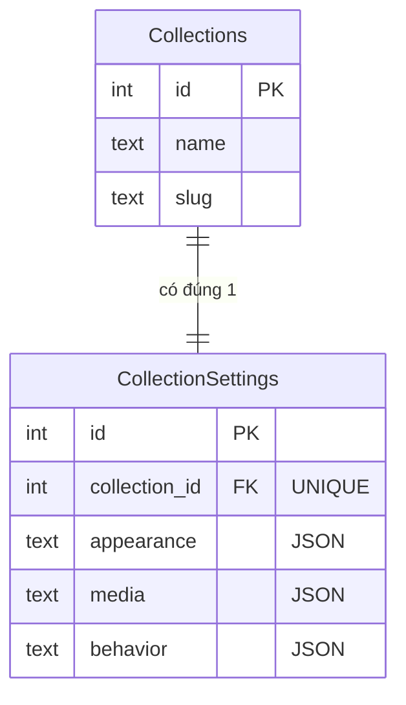
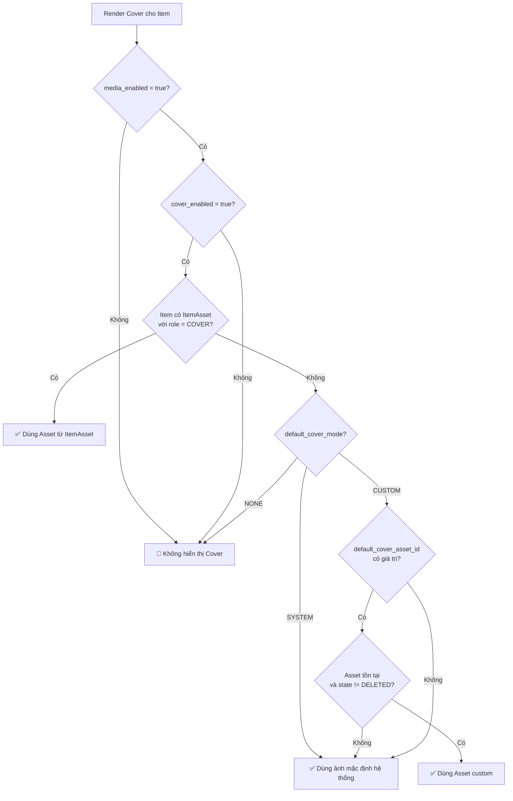
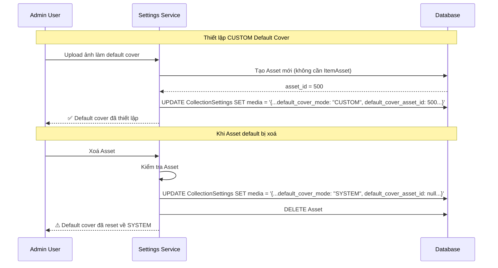
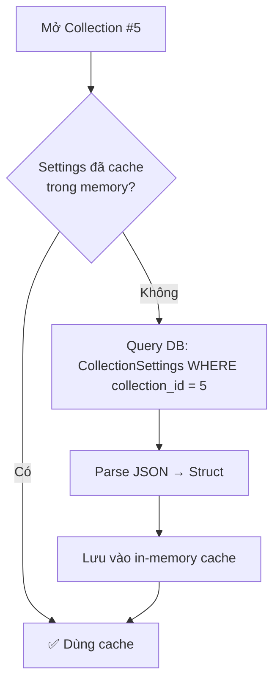

# ⚙️ Thiết kế CollectionSettings (CollectionSettings Design)

> **Tài liệu bổ trợ cho:** [Đặc tả Thiết kế Database](./database-design-specification.md) — Section 2.1.1 CollectionSettings
>
> **Phạm vi:** Thiết kế chi tiết bảng CollectionSettings — tách settings khỏi Collections, cấu trúc JSON theo nhóm chức năng, cơ chế Default Cover, lifecycle, validation, caching ở tầng ứng dụng, và migration path. Tài liệu này **không chứa SQL hay migration script**.

---

## 📋 TL;DR

| Khía cạnh             | Mô tả                                                                                      |
| --------------------- | ------------------------------------------------------------------------------------------ |
| **Quan hệ**           | 1-1 với Collections, cascade delete                                                        |
| **3 nhóm JSON**       | `appearance` (giao diện), `media` (tính năng media), `behavior` (hành vi)                  |
| **Media opt-in**      | `media_enabled = false` mặc định — Collection phải bật chủ động                            |
| **Default Cover**     | 3 mode: SYSTEM (built-in), CUSTOM (admin chọn), NONE (không hiển thị)                      |
| **Mở rộng**           | Thêm setting mới = thêm trường vào JSON, không cần migration                               |
| **Cache ứng dụng**    | Đọc 1 lần khi mở Collection, cache in-memory, invalidation khi cập nhật                   |

---

## 1. Bối cảnh & Motivation

### Vấn đề với settings trực tiếp trên Collections

Thiết kế ban đầu có cột `media_enabled` trực tiếp trên bảng `Collections`. Khi hệ thống mở rộng, nhiều settings cần bổ sung:

1. **Phình bảng lõi:** Mỗi setting mới = 1 cột mới trên `Collections`. Bảng này được query rất thường xuyên (mở app, chuyển Collection) → cột dư thừa ảnh hưởng I/O.
2. **Vòng đời khác biệt:** Settings thay đổi thường xuyên (admin tinh chỉnh giao diện, bật/tắt tính năng), trong khi metadata định danh (name, slug, icon) hiếm khi đổi. Gộp chung → `updated_at` của Collections bị nhiễu.
3. **Migration liên tục:** Mỗi setting mới cần ALTER TABLE → migration, rebuild index, downtime ngắn. Với JSON, chỉ cần thêm trường vào schema validation ở tầng ứng dụng.

### Mục tiêu thiết kế

- Tách settings ra bảng riêng, giữ `Collections` gọn gàng.
- Nhóm settings theo chức năng (appearance/media/behavior) thay vì cột rời rạc.
- Dùng JSON để dễ mở rộng mà không cần database migration.
- Hỗ trợ default values ở tầng ứng dụng cho các trường chưa tồn tại trong JSON.

---

## 2. Schema Chi tiết

### 2.1 Bảng CollectionSettings

| Cột             | Kiểu    | Bắt buộc | Mô tả                                                   |
| --------------- | ------- | :------: | ------------------------------------------------------- |
| `id`            | INTEGER |    ✔     | Khoá chính tự tăng                                      |
| `collection_id` | INTEGER |    ✔     | FK → Collections, **UNIQUE** (đảm bảo 1-1)              |
| `appearance`    | TEXT    |    ✔     | JSON — thiết lập giao diện                               |
| `media`         | TEXT    |    ✔     | JSON — thiết lập media                                   |
| `behavior`      | TEXT    |    ✔     | JSON — thiết lập hành vi                                 |
| `created_at`    | TEXT    |    ✔     | ISO 8601 timestamp                                      |
| `updated_at`    | TEXT    |    ✔     | Tự động cập nhật khi có thay đổi                         |

### 2.2 Quan hệ với Collections



**Ràng buộc:**
- `collection_id` là UNIQUE — đảm bảo mỗi Collection có **đúng 1** bản ghi settings.
- FK với ON DELETE CASCADE — xoá Collection sẽ tự động xoá settings tương ứng.
- Tạo CollectionSettings **cùng lúc** với Collections (trong cùng transaction).

---

## 3. Nhóm `media` — Cấu trúc JSON

### 3.1 Schema đầy đủ

```json
{
    "media_enabled": false,
    "cover_enabled": true,
    "default_cover_mode": "SYSTEM",
    "default_cover_asset_id": null,
    "allowed_roles": ["COVER", "GALLERY", "SCREENSHOT", "ATTACHMENT"]
}
```

### 3.2 Chi tiết từng trường

#### `media_enabled` — Cổng bật/tắt tính năng Media

| Thuộc tính     | Giá trị                                                                        |
| -------------- | ------------------------------------------------------------------------------ |
| **Kiểu**       | `boolean`                                                                      |
| **Mặc định**   | `false`                                                                        |
| **Mục đích**   | Cổng gatekeeper cho toàn bộ nhánh Media. Khi `false`, không thể tạo/xem Asset. |
| **Ảnh hưởng**  | UI ẩn tab Media, Service từ chối API tạo ItemAsset cho Collection này.          |

**Tại sao mặc định `false`:**
- Media là tính năng tốn tài nguyên (lưu file, sinh thumbnail, cache).
- Không phải Collection nào cũng cần media (ví dụ: Notes, Contacts).
- Opt-in rõ ràng → người dùng hiểu chi phí trước khi bật.

#### `cover_enabled` — Hỗ trợ Cover

| Thuộc tính     | Giá trị                                                                     |
| -------------- | --------------------------------------------------------------------------- |
| **Kiểu**       | `boolean`                                                                   |
| **Mặc định**   | `true`                                                                      |
| **Điều kiện**   | Chỉ có ý nghĩa khi `media_enabled = true`                                  |
| **Mục đích**   | Quyết định Collection có hiển thị Cover trong Grid/List View hay không      |
| **Ảnh hưởng**  | Khi `false`, Grid/List không hiển thị Cover, không hiển thị Default Cover    |

#### `default_cover_mode` — Chế độ ảnh bìa mặc định

| Thuộc tính     | Giá trị                                                                     |
| -------------- | --------------------------------------------------------------------------- |
| **Kiểu**       | `enum string` — `SYSTEM` \| `CUSTOM` \| `NONE`                             |
| **Mặc định**   | `SYSTEM`                                                                    |
| **Điều kiện**   | Chỉ có ý nghĩa khi `cover_enabled = true`                                  |
| **Mục đích**   | Xác định ảnh hiển thị khi Item không có Cover riêng                         |

| Mode       | Hành vi                                                                |
| ---------- | ---------------------------------------------------------------------- |
| `SYSTEM`   | Dùng ảnh mặc định built-in (đóng gói cùng app), không lưu trong DB    |
| `CUSTOM`   | Dùng Asset cụ thể được chỉ định bởi `default_cover_asset_id`          |
| `NONE`     | Không hiển thị Cover → UI hiển thị placeholder hoặc ẩn vùng Cover      |

#### `default_cover_asset_id` — Asset mặc định cho CUSTOM mode

| Thuộc tính     | Giá trị                                                                     |
| -------------- | --------------------------------------------------------------------------- |
| **Kiểu**       | `integer?` (nullable)                                                       |
| **Mặc định**   | `null`                                                                      |
| **Điều kiện**   | Chỉ có giá trị khi `default_cover_mode = CUSTOM`                            |
| **Mục đích**   | Tham chiếu tới Asset dùng làm ảnh bìa mặc định                             |
| **FK logic**   | Tham chiếu Assets.id — enforce ở tầng ứng dụng (nằm trong JSON)            |

**Lưu ý quan trọng:**
- Đây là FK **logic**, không phải FK ở tầng database (vì nằm trong cột JSON).
- Khi Asset được tham chiếu bị xoá → Service phải reset `default_cover_mode` về `SYSTEM` và `default_cover_asset_id` về `null`.
- Asset này không cần liên kết qua ItemAssets — nó được dùng trực tiếp bởi logic fallback.

#### `allowed_roles` — Danh sách role được phép

| Thuộc tính     | Giá trị                                                                     |
| -------------- | --------------------------------------------------------------------------- |
| **Kiểu**       | `string[]` (JSON array)                                                     |
| **Mặc định**   | `["COVER", "GALLERY", "SCREENSHOT", "ATTACHMENT"]`                          |
| **Điều kiện**   | Chỉ có ý nghĩa khi `media_enabled = true`                                  |
| **Mục đích**   | Giới hạn role nào được phép tạo ItemAsset trong Collection này              |

**Validation rules:**
- Mỗi phần tử phải nằm trong 7 role hợp lệ: `COVER`, `BACKGROUND`, `LOGO`, `BANNER`, `GALLERY`, `SCREENSHOT`, `ATTACHMENT`.
- Mảng rỗng `[]` có nghĩa: media bật nhưng không cho phép role nào (edge case — tương đương tắt media về mặt nghiệp vụ).
- Thứ tự phần tử không quan trọng (tập hợp, không phải danh sách có thứ tự).

---

## 4. Nhóm `appearance` — Cấu trúc JSON

### 4.1 Schema hiện tại

```json
{
    "default_view_mode": "GRID",
    "card_size": "MEDIUM",
    "show_title_on_card": true
}
```

### 4.2 Chi tiết từng trường

| Trường                | Kiểu        | Mặc định   | Mô tả                                                      |
| --------------------- | ----------- | ---------- | ---------------------------------------------------------- |
| `default_view_mode`   | enum string | `GRID`     | Chế độ hiển thị khi mở Collection: `GRID` \| `LIST` \| `TABLE` |
| `card_size`           | enum string | `MEDIUM`   | Kích thước card trong Grid View: `SMALL` \| `MEDIUM` \| `LARGE` |
| `show_title_on_card`  | boolean     | `true`     | Hiển thị tiêu đề Item trên card hay không                   |

### 4.3 Mở rộng dự kiến

Các trường có thể bổ sung trong tương lai mà **không cần migration**:

| Trường (dự kiến)       | Kiểu    | Mô tả                                           |
| ---------------------- | ------- | ----------------------------------------------- |
| `card_aspect_ratio`    | string  | Tỉ lệ card: `2:3`, `16:9`, `1:1`               |
| `accent_color`         | string  | Màu nhấn cho Collection (hex code)              |
| `show_metadata_badges` | boolean | Hiển thị badge metadata trên card               |
| `grid_gap`             | string  | Khoảng cách giữa các card: `COMPACT` \| `NORMAL` \| `SPACIOUS` |

---

## 5. Nhóm `behavior` — Cấu trúc JSON

### 5.1 Schema hiện tại

```json
{
    "default_sort_field": "created_at",
    "default_sort_order": "DESC"
}
```

### 5.2 Chi tiết từng trường

| Trường               | Kiểu        | Mặc định     | Mô tả                                                          |
| -------------------- | ----------- | ------------ | -------------------------------------------------------------- |
| `default_sort_field` | string      | `created_at` | Cột sắp xếp mặc định: `created_at` \| `updated_at` \| `title` |
| `default_sort_order` | enum string | `DESC`       | Thứ tự sắp xếp: `ASC` \| `DESC`                               |

### 5.3 Mở rộng dự kiến

| Trường (dự kiến)        | Kiểu    | Mô tả                                                         |
| ----------------------- | ------- | ------------------------------------------------------------- |
| `pagination_strategy`   | string  | `INFINITE_SCROLL` \| `PAGINATION`                             |
| `items_per_page`        | integer | Số Item mỗi trang (khi dùng pagination)                       |
| `auto_cache_remote`     | boolean | Tự động cache Asset REMOTE khi import                         |
| `confirm_before_delete` | boolean | Yêu cầu xác nhận trước khi xoá Item                          |

---

## 6. Cơ chế Default Cover — Chi tiết

### 6.1 Flowchart đầy đủ



### 6.2 Ảnh mặc định hệ thống theo Collection

Ảnh SYSTEM có thể tuỳ biến theo loại Collection:

| Collection           | Ảnh SYSTEM mặc định                     |
| -------------------- | ---------------------------------------- |
| Movies / TV Shows    | Icon phim generic (🎬 filmstrip)         |
| Books                | Icon sách generic (📚 book cover)        |
| Games                | Icon game generic (🎮 gamepad)           |
| Music                | Icon âm nhạc generic (🎵 music note)    |
| Mặc định chung       | Icon placeholder generic (🖼️ image)     |

Ảnh SYSTEM được đóng gói trong bundle app, không lưu trong database Assets.

### 6.3 Lifecycle của CUSTOM Default Cover



---

## 7. Lifecycle

### 7.1 Tạo CollectionSettings

Khi tạo Collection mới, CollectionSettings được tạo **trong cùng transaction** với giá trị mặc định:

```json
{
    "appearance": {
        "default_view_mode": "GRID",
        "card_size": "MEDIUM",
        "show_title_on_card": true
    },
    "media": {
        "media_enabled": false,
        "cover_enabled": true,
        "default_cover_mode": "SYSTEM",
        "default_cover_asset_id": null,
        "allowed_roles": ["COVER", "GALLERY", "SCREENSHOT", "ATTACHMENT"]
    },
    "behavior": {
        "default_sort_field": "created_at",
        "default_sort_order": "DESC"
    }
}
```

### 7.2 Cập nhật CollectionSettings

| Hành động                   | Ảnh hưởng                                                              |
| --------------------------- | ---------------------------------------------------------------------- |
| Đổi `default_view_mode`    | Chỉ ảnh hưởng UI, không ảnh hưởng dữ liệu                             |
| Bật `media_enabled`        | UI hiển thị tab Media, Service cho phép tạo ItemAsset                  |
| Tắt `media_enabled`        | UI ẩn tab Media, Service từ chối API mới. **Không xoá** dữ liệu hiện có. |
| Đổi `default_cover_mode`   | Ảnh hưởng Item chưa có Cover riêng — thay đổi tức thì trên Grid/List  |
| Thay đổi `allowed_roles`   | Không xoá ItemAssets hiện có — chỉ ảnh hưởng khả năng tạo mới          |

### 7.3 Xoá CollectionSettings

- Cascade delete khi Collection bị xoá — không cần xử lý riêng.
- **Không bao giờ** xoá CollectionSettings mà giữ Collection — quan hệ 1-1 bắt buộc.

---

## 8. Validation

### 8.1 Quy tắc validate ở tầng ứng dụng

#### Nhóm `media`

| Quy tắc                                                                    | Loại       |
| --------------------------------------------------------------------------- | ---------- |
| `media_enabled` phải là boolean                                             | Type check |
| `cover_enabled` phải là boolean                                             | Type check |
| `default_cover_mode` phải là `SYSTEM` \| `CUSTOM` \| `NONE`                | Enum check |
| `default_cover_asset_id` bắt buộc khi `default_cover_mode = CUSTOM`        | Conditional|
| `default_cover_asset_id` phải tham chiếu Asset tồn tại                     | FK check   |
| `allowed_roles` là mảng, mỗi phần tử ∈ 7 role hợp lệ                      | Enum check |
| Nếu `media_enabled = false`, các trường media khác bị bỏ qua (vẫn lưu)     | Business   |

#### Nhóm `appearance`

| Quy tắc                                                    | Loại       |
| ----------------------------------------------------------- | ---------- |
| `default_view_mode` phải là `GRID` \| `LIST` \| `TABLE`    | Enum check |
| `card_size` phải là `SMALL` \| `MEDIUM` \| `LARGE`         | Enum check |
| `show_title_on_card` phải là boolean                        | Type check |

#### Nhóm `behavior`

| Quy tắc                                                           | Loại       |
| ------------------------------------------------------------------ | ---------- |
| `default_sort_field` phải là `created_at` \| `updated_at` \| `title` | Enum check |
| `default_sort_order` phải là `ASC` \| `DESC`                       | Enum check |

### 8.2 Xử lý trường thiếu (Forward Compatibility)

Khi ứng dụng nâng cấp thêm trường mới vào JSON schema, các bản ghi cũ chưa có trường đó. Chiến lược:

| Chiến lược           | Mô tả                                                                       |
| -------------------- | --------------------------------------------------------------------------- |
| **Default fallback** | Khi đọc JSON, nếu trường không tồn tại → dùng giá trị mặc định ở code      |
| **Không migration**  | Không chạy migration để backfill trường mới vào JSON cũ                      |
| **Lazy update**      | Khi user lưu settings lần tiếp theo, trường mới sẽ được ghi kèm             |

**Ví dụ:**
```
// Phiên bản 1.0: JSON không có trường `card_aspect_ratio`
{ "default_view_mode": "GRID", "card_size": "MEDIUM" }

// Ứng dụng 2.0 đọc JSON này → trường `card_aspect_ratio` thiếu
// → dùng default value "2:3" từ code
// → khi user lưu settings lần tiếp theo:
{ "default_view_mode": "GRID", "card_size": "MEDIUM", "card_aspect_ratio": "2:3" }
```

---

## 9. Caching ở Tầng Ứng dụng

### 9.1 Strategy



### 9.2 Invalidation

| Sự kiện                         | Hành động cache                                       |
| ------------------------------- | ----------------------------------------------------- |
| Admin cập nhật settings         | Invalidate cache cho collection_id tương ứng          |
| Xoá Collection                  | Xoá entry cache                                       |
| Xoá Asset được dùng làm default | Invalidate cache (settings sẽ được cập nhật tự động)  |
| Khởi động ứng dụng              | Cache rỗng — lazy load khi mở từng Collection          |

### 9.3 Granularity

| Tuỳ chọn                     | Đánh giá                                                                        |
| ----------------------------- | ------------------------------------------------------------------------------- |
| ✅ **Đã chọn:** Cache per collection | (+) Đơn giản, invalidation chính xác. (−) Cache miss khi chuyển Collection.     |
| Cache toàn bộ settings       | (+) Không cache miss. (−) Tốn memory khi nhiều Collection, hầu hết không dùng. |

---

## 10. Migration Path

### 10.1 Từ `media_enabled` trên Collections → CollectionSettings

Nếu codebase hiện tại có cột `media_enabled` trực tiếp trên bảng `Collections`, luồng migration:

1. **Tạo bảng `CollectionSettings`** với cấu trúc đã định nghĩa.
2. **Migrate dữ liệu:**
    - Với mỗi Collection hiện có, tạo 1 bản ghi CollectionSettings.
    - Copy giá trị `Collections.media_enabled` → `CollectionSettings.media.media_enabled` trong JSON.
    - Các trường khác dùng giá trị mặc định.
3. **Xoá cột `media_enabled`** khỏi bảng `Collections`.
4. **Cập nhật code:**
    - Đọc settings từ `CollectionSettings` thay vì `Collections.media_enabled`.
    - Cập nhật API/Service layer.

### 10.2 Rollback plan

| Bước    | Rollback                                                    |
| ------- | ----------------------------------------------------------- |
| Bước 1  | DROP TABLE CollectionSettings                               |
| Bước 2  | Dữ liệu đã copy → không mất                                |
| Bước 3  | Re-add cột `media_enabled` trên Collections, restore giá trị |

---

## 11. Ví dụ Dữ liệu

### 11.1 Movies Collection — Full media

```json
{
    "appearance": {
        "default_view_mode": "GRID",
        "card_size": "MEDIUM",
        "show_title_on_card": true
    },
    "media": {
        "media_enabled": true,
        "cover_enabled": true,
        "default_cover_mode": "CUSTOM",
        "default_cover_asset_id": 500,
        "allowed_roles": ["COVER", "BACKGROUND", "LOGO", "GALLERY"]
    },
    "behavior": {
        "default_sort_field": "created_at",
        "default_sort_order": "DESC"
    }
}
```

**Giải thích:** Collection phim bật đầy đủ media, có ảnh bìa mặc định custom (Asset #500), cho phép 4 role: poster, backdrop, title logo, và gallery stills.

### 11.2 Books Collection — Minimal media

```json
{
    "appearance": {
        "default_view_mode": "LIST",
        "card_size": "SMALL",
        "show_title_on_card": true
    },
    "media": {
        "media_enabled": true,
        "cover_enabled": true,
        "default_cover_mode": "SYSTEM",
        "default_cover_asset_id": null,
        "allowed_roles": ["COVER", "ATTACHMENT"]
    },
    "behavior": {
        "default_sort_field": "title",
        "default_sort_order": "ASC"
    }
}
```

**Giải thích:** Collection sách dùng List View, sắp xếp theo tên. Media bật nhưng chỉ cho phép Cover (bìa sách) và Attachment (PDF excerpt). Default cover dùng ảnh hệ thống.

### 11.3 Notes Collection — No media

```json
{
    "appearance": {
        "default_view_mode": "TABLE",
        "card_size": "MEDIUM",
        "show_title_on_card": true
    },
    "media": {
        "media_enabled": false,
        "cover_enabled": false,
        "default_cover_mode": "NONE",
        "default_cover_asset_id": null,
        "allowed_roles": []
    },
    "behavior": {
        "default_sort_field": "updated_at",
        "default_sort_order": "DESC"
    }
}
```

**Giải thích:** Collection ghi chú không cần media — hiển thị dạng bảng, sắp xếp theo thời gian cập nhật.

### 11.4 Games Collection — Full featured

```json
{
    "appearance": {
        "default_view_mode": "GRID",
        "card_size": "LARGE",
        "show_title_on_card": false
    },
    "media": {
        "media_enabled": true,
        "cover_enabled": true,
        "default_cover_mode": "SYSTEM",
        "default_cover_asset_id": null,
        "allowed_roles": ["COVER", "BACKGROUND", "LOGO", "BANNER", "SCREENSHOT", "GALLERY"]
    },
    "behavior": {
        "default_sort_field": "created_at",
        "default_sort_order": "DESC"
    }
}
```

**Giải thích:** Collection game bật đầy đủ role (6/7), hiển thị Grid lớn không hiện title (vì Cover đã đủ nhận diện). Dùng ảnh hệ thống mặc định.

---

## 🔗 Tài liệu Liên quan

- [Đặc tả Thiết kế Database](./database-design-specification.md) — Section 2.1.1 CollectionSettings
- [Kiến trúc Nguồn Asset](./asset-source-architecture.md)
- [Hệ thống Multi-role Asset](./multi-role-asset-system.md)

---

_Cập nhật: 2026-07-28_
