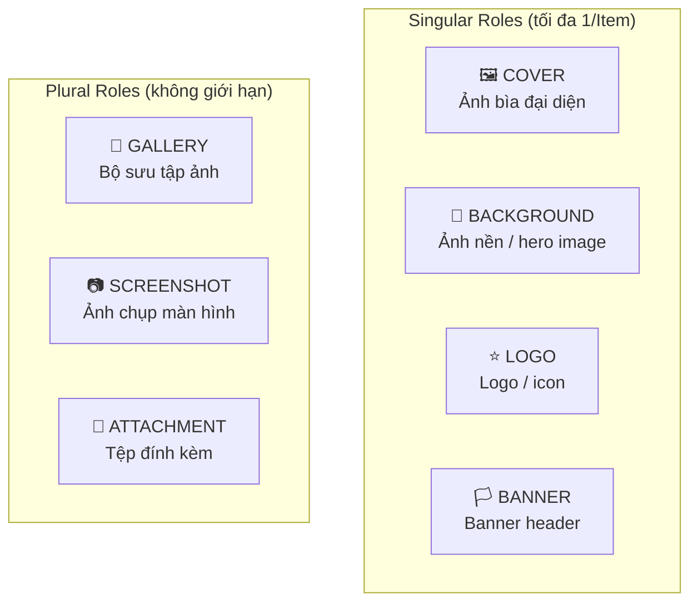
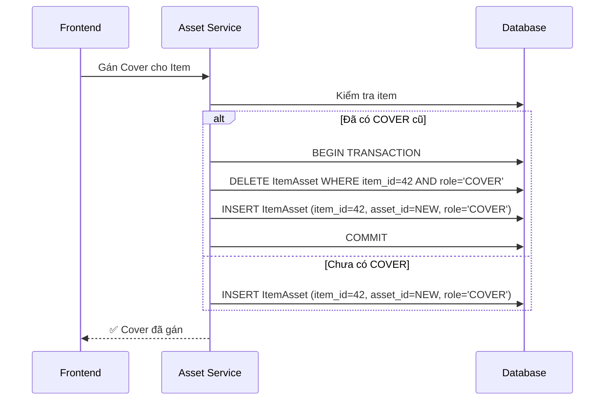
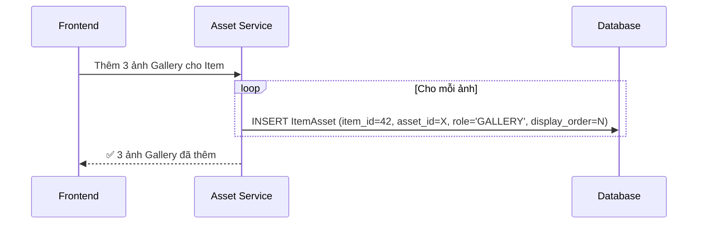
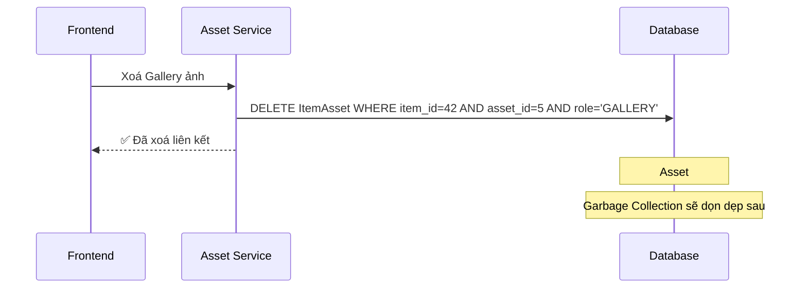
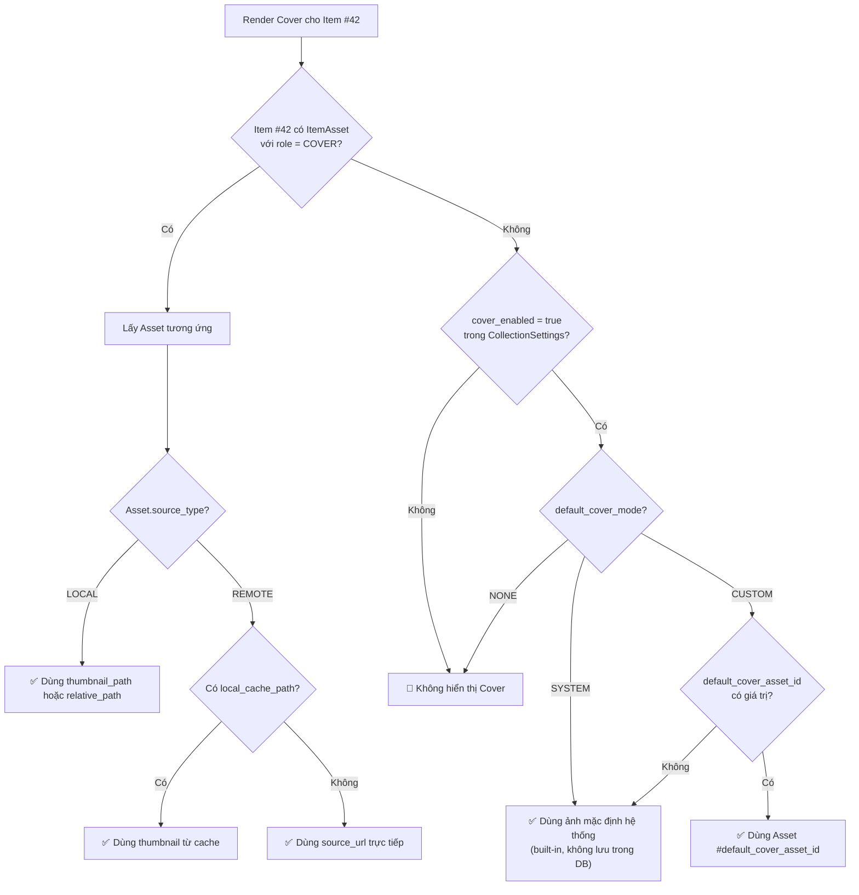

# 🏷️ Hệ thống Multi-role Asset (Multi-role Asset System)

> **Tài liệu bổ trợ cho:** [Đặc tả Thiết kế Database](./database-design-specification.md) — Section 2.6 ItemAssets
>
> **Phạm vi:** Thiết kế chi tiết hệ thống 7 role cho ItemAssets, bao gồm phân loại Singular/Plural, ràng buộc, luồng nghiệp vụ, query patterns, và cơ chế Default Cover fallback. Tài liệu này **không chứa SQL hay migration script**.

---

## 📋 TL;DR

| Khía cạnh              | Mô tả                                                                                      |
| ---------------------- | ------------------------------------------------------------------------------------------ |
| **7 roles**            | COVER, BACKGROUND, LOGO, BANNER (Singular) + GALLERY, SCREENSHOT, ATTACHMENT (Plural)      |
| **Singular = max 1**   | Mỗi Item có tối đa 1 Asset cho mỗi Singular Role, enforce bởi partial unique index         |
| **Plural = không giới hạn** | Nhiều Asset cho mỗi Plural Role, chỉ ràng buộc unique (item_id, asset_id)             |
| **Role validation**    | CollectionSettings.media.allowed_roles quyết định role nào được phép trong mỗi Collection   |
| **Default Cover**      | Fallback ở tầng ứng dụng khi Item không có COVER — không tạo ItemAssets mặc định           |

---

## 1. Bối cảnh & Motivation

### Vấn đề với 2 role (COVER/ATTACHMENT)

Thiết kế ban đầu chỉ có hai role: `COVER` (ảnh bìa đại diện) và `ATTACHMENT` (tệp đính kèm chung). Điều này gây ra:

1. **Thiếu ngữ nghĩa:** Ảnh nền (background), logo, banner, screenshot, gallery — tất cả đều bị gộp thành `ATTACHMENT`, mất đi ý nghĩa và mục đích sử dụng riêng.
2. **Không thể render đúng vị trí:** UI cần phân biệt "ảnh nào hiển thị ở đâu" — header dùng background, sidebar dùng logo, detail page dùng gallery — nhưng tất cả đều cùng role `ATTACHMENT`.
3. **Khó mở rộng UI:** Khi muốn thêm hero banner cho trang chi tiết Item, phải dùng convention naming hoặc metadata phụ trong JSON — thiếu nhất quán.

### Mục tiêu thiết kế

- Phân loại rõ ràng mục đích sử dụng của từng Asset thông qua role.
- Enforce ràng buộc "tối đa 1" cho các role đơn (Cover, Background, Logo, Banner) ngay ở tầng database.
- Cho phép nhiều Asset cho các role bộ sưu tập (Gallery, Screenshot, Attachment).
- Mỗi Collection có thể giới hạn role nào được phép sử dụng.
- Giữ nguyên mô hình `Items → ItemAssets → Assets`.

---

## 2. Taxonomy Role

### 2.1 Tổng quan phân loại



### 2.2 Chi tiết từng role

#### COVER (Singular)

| Thuộc tính        | Giá trị                                                        |
| ----------------- | -------------------------------------------------------------- |
| **Mục đích**      | Ảnh bìa đại diện chính của Item, hiển thị trong Grid/List View |
| **Tối đa / Item** | 1                                                              |
| **Khi nào dùng**  | Poster phim, bìa sách, box art game, ảnh đại diện album       |
| **Vị trí UI**     | Card trong Grid, thumbnail trong List, header trang chi tiết   |
| **Fallback**      | Default Cover từ CollectionSettings (xem Section 7)            |

#### BACKGROUND (Singular)

| Thuộc tính        | Giá trị                                                              |
| ----------------- | -------------------------------------------------------------------- |
| **Mục đích**      | Ảnh nền cho trang chi tiết, hero image, backdrop                     |
| **Tối đa / Item** | 1                                                                    |
| **Khi nào dùng**  | Backdrop phim (fanart), ảnh nền chi tiết game, landscape photography |
| **Vị trí UI**     | Background trang chi tiết, hero section, parallax                    |
| **Fallback**      | Không hiển thị nếu không có                                         |

#### LOGO (Singular)

| Thuộc tính        | Giá trị                                                        |
| ----------------- | -------------------------------------------------------------- |
| **Mục đích**      | Logo hoặc icon riêng của Item (không phải icon Collection)     |
| **Tối đa / Item** | 1                                                              |
| **Khi nào dùng**  | Logo phim (title treatment), logo game, logo publisher         |
| **Vị trí UI**     | Overlay trên background, header chi tiết                       |
| **Fallback**      | Hiển thị title text nếu không có                               |

#### BANNER (Singular)

| Thuộc tính        | Giá trị                                                        |
| ----------------- | -------------------------------------------------------------- |
| **Mục đích**      | Banner ngang cho quảng cáo, header, hoặc decorative image      |
| **Tối đa / Item** | 1                                                              |
| **Khi nào dùng**  | Banner quảng bá phim, header game page, feature highlight      |
| **Vị trí UI**     | Top banner trang chi tiết, carousel highlight                  |
| **Fallback**      | Không hiển thị nếu không có                                    |

#### GALLERY (Plural)

| Thuộc tính        | Giá trị                                                        |
| ----------------- | -------------------------------------------------------------- |
| **Mục đích**      | Bộ sưu tập hình ảnh liên quan đến Item                        |
| **Tối đa / Item** | N (không giới hạn)                                             |
| **Khi nào dùng**  | Production stills phim, ảnh minh hoạ sách, wallpapers game     |
| **Vị trí UI**     | Tab "Gallery" trong trang chi tiết, lightbox viewer            |
| **Sắp xếp**       | Theo `display_order`                                           |

#### SCREENSHOT (Plural)

| Thuộc tính        | Giá trị                                                        |
| ----------------- | -------------------------------------------------------------- |
| **Mục đích**      | Ảnh chụp màn hình — đặc biệt hữu ích cho game, phần mềm      |
| **Tối đa / Item** | N (không giới hạn)                                             |
| **Khi nào dùng**  | Screenshots game, screenshots app, preview phần mềm           |
| **Vị trí UI**     | Tab "Screenshots" trong trang chi tiết, carousel               |
| **Sắp xếp**       | Theo `display_order`                                           |

#### ATTACHMENT (Plural)

| Thuộc tính        | Giá trị                                                        |
| ----------------- | -------------------------------------------------------------- |
| **Mục đích**      | Tệp đính kèm tổng quát, không phân loại cụ thể               |
| **Tối đa / Item** | N (không giới hạn)                                             |
| **Khi nào dùng**  | Tài liệu bổ sung, file tham khảo, ảnh không thuộc nhóm khác  |
| **Vị trí UI**     | Tab "Attachments" hoặc "Files" trong trang chi tiết            |
| **Sắp xếp**       | Theo `display_order`                                           |

### 2.3 Use case theo loại Collection

| Collection   | Roles thường dùng                                                  |
| ------------ | ------------------------------------------------------------------ |
| **Movies**   | COVER (poster), BACKGROUND (backdrop), LOGO (title), GALLERY       |
| **TV Shows** | COVER (poster), BACKGROUND (backdrop), BANNER, SCREENSHOT          |
| **Games**    | COVER (box art), BACKGROUND (key art), LOGO, SCREENSHOT, GALLERY   |
| **Books**    | COVER (bìa sách), ATTACHMENT (PDF excerpt)                         |
| **Music**    | COVER (album art), BACKGROUND (artist photo), GALLERY              |
| **Notes**    | ATTACHMENT (ảnh đính kèm)                                          |

---

## 3. Ràng buộc & Enforcement

### 3.1 Partial Unique Index cho Singular Roles

Mỗi Singular Role có một **partial unique index** riêng trên bảng ItemAssets:

```
Index: uq_item_cover       → UNIQUE(item_id) WHERE role = 'COVER'
Index: uq_item_background  → UNIQUE(item_id) WHERE role = 'BACKGROUND'
Index: uq_item_logo        → UNIQUE(item_id) WHERE role = 'LOGO'
Index: uq_item_banner      → UNIQUE(item_id) WHERE role = 'BANNER'
```

**Cách hoạt động:**
- Khi INSERT một dòng `ItemAssets` với `role = COVER` cho `item_id = 42`, nếu đã tồn tại dòng `(item_id=42, role=COVER)`, database sẽ **từ chối** với lỗi UNIQUE constraint violation.
- Không ảnh hưởng đến Plural Roles — có thể INSERT nhiều dòng `role = GALLERY` cho cùng `item_id`.

### 3.2 Unique (item_id, asset_id) — Áp dụng cho tất cả role

Ngăn việc liên kết **cùng một Asset** với **cùng một Item** nhiều lần, bất kể role:

```
Index: uq_item_asset → UNIQUE(item_id, asset_id)
```

**Kết quả:** Một Item không thể có cùng 1 Asset vừa là COVER vừa là GALLERY. Nếu cần ảnh giống nhau cho hai role, phải tạo hai bản ghi Asset riêng (hoặc chấp nhận ràng buộc này).

### 3.3 Tổng hợp ràng buộc

| Ràng buộc                                   | Áp dụng cho              | Mục đích                                     |
| ------------------------------------------- | ------------------------ | -------------------------------------------- |
| Partial unique trên `item_id` per role       | Mỗi Singular Role        | Tối đa 1 Asset cho mỗi Singular Role / Item |
| Unique `(item_id, asset_id)`                 | Tất cả role              | Ngăn liên kết trùng                          |
| CHECK `role ∈ {7 giá trị}`                  | Tất cả dòng ItemAssets   | Đảm bảo chỉ dùng role hợp lệ                |
| `allowed_roles` trong CollectionSettings     | Tầng ứng dụng            | Giới hạn role theo Collection                |

---

## 4. Luồng Nghiệp vụ

### 4.1 Gán Cover cho Item



**Lưu ý:** Đổi Cover phải trong **một transaction** để tránh trạng thái tạm thời (0 hoặc 2 COVER) khi có thao tác đồng thời. Partial unique index là tuyến phòng thủ cuối cùng ở tầng DB.

### 4.2 Thêm ảnh Gallery



**Lưu ý:** Gallery không cần transaction phức tạp vì là Plural Role — không có ràng buộc "tối đa 1".

### 4.3 Xoá một ảnh cụ thể



---

## 5. Query Patterns

### 5.1 Lấy Cover cho Grid/List View (Hot Path)

**Context:** Truy vấn phổ biến nhất — cần Cover + thumbnail cho hàng trăm/nghìn Item trong viewport.

**Chiến lược:**
1. Truy vấn ItemAssets theo `(item_id, role='COVER')` → lấy `asset_id`
2. JOIN Assets để lấy `thumbnail_path` (hoặc `source_url` nếu REMOTE chưa cache)
3. Index `(item_id, role)` phục vụ truy vấn này cực nhanh

**Batch query:** Lấy Cover cho tất cả Item trong một trang (50 Item):
- Truy vấn: Lọc ItemAssets theo `item_id IN (danh sách 50 id)` AND `role = 'COVER'`
- Kết quả: Tối đa 50 dòng (vì Singular)
- Item không có Cover: Áp dụng Default Cover fallback (xem Section 7)

### 5.2 Lấy toàn bộ Asset cho trang chi tiết

**Context:** Khi người dùng mở trang chi tiết Item — cần tất cả các role.

**Chiến lược:**
1. Truy vấn ItemAssets theo `item_id = X` → JOIN Assets
2. Nhóm kết quả theo `role` ở tầng ứng dụng
3. Sắp xếp Plural Roles theo `display_order`

**Cấu trúc kết quả ở tầng ứng dụng:**
```
{
    cover: Asset | null,
    background: Asset | null,
    logo: Asset | null,
    banner: Asset | null,
    gallery: Asset[],        // sắp xếp theo display_order
    screenshots: Asset[],    // sắp xếp theo display_order
    attachments: Asset[],    // sắp xếp theo display_order
}
```

### 5.3 Đếm Asset theo role

**Context:** Hiển thị badge đếm trên tab (ví dụ: "Gallery (12)", "Screenshots (5)").

**Chiến lược:** Truy vấn đếm ItemAssets theo `(item_id, role)` — nhóm theo `role`.

### 5.4 Truy vấn ngược: Asset này được dùng ở đâu?

**Context:** Garbage Collection cần biết Asset nào là orphan.

**Chiến lược:** Truy vấn ItemAssets theo `asset_id` — index trên `asset_id` phục vụ truy vấn này.

---

## 6. Role Validation theo Collection

### 6.1 Cơ chế allowed_roles

Mỗi Collection có danh sách role được phép trong `CollectionSettings.media.allowed_roles`:

```json
{
    "allowed_roles": ["COVER", "BACKGROUND", "GALLERY", "SCREENSHOT"]
}
```

**Enforcement ở tầng ứng dụng:**
1. Khi tạo ItemAsset, Service kiểm tra `role` có nằm trong `allowed_roles` của Collection sở hữu Item không.
2. Nếu role không được phép → từ chối với lỗi validation.
3. UI chỉ hiển thị các tab/nút tương ứng với `allowed_roles`.

### 6.2 Ví dụ cấu hình theo Collection

| Collection | allowed_roles                                              | Giải thích                                |
| ---------- | ---------------------------------------------------------- | ----------------------------------------- |
| Movies     | `[COVER, BACKGROUND, LOGO, GALLERY]`                      | Poster, backdrop, title logo, stills      |
| Games      | `[COVER, BACKGROUND, LOGO, SCREENSHOT, GALLERY]`          | Box art, key art, logo, in-game shots     |
| Books      | `[COVER, ATTACHMENT]`                                      | Bìa sách và PDF excerpt                   |
| Notes      | `[ATTACHMENT]`                                             | Chỉ đính kèm file, không cần media khác  |

### 6.3 Thay đổi allowed_roles

| Hành động                    | Ảnh hưởng                                                                  |
| ---------------------------- | -------------------------------------------------------------------------- |
| Thêm role mới vào danh sách | Không ảnh hưởng dữ liệu hiện có. UI bắt đầu hiển thị tab mới.            |
| Xoá role khỏi danh sách     | ItemAssets hiện có **không bị xoá** — chỉ không thể tạo mới. UI ẩn tab.   |
| Xoá tất cả role              | Tương đương media_enabled = false cho phần role.                           |

---

## 7. Default Cover Fallback

### 7.1 Flowchart chi tiết



### 7.2 Ảnh mặc định hệ thống (SYSTEM)

- Ảnh built-in được đóng gói cùng ứng dụng, không lưu trong DB.
- Có thể là ảnh generic (ví dụ: icon placeholder) hoặc theo loại Collection (icon phim, icon sách...).
- Không tạo bản ghi Asset hay ItemAsset cho ảnh mặc định này.

### 7.3 Ảnh mặc định tuỳ chọn (CUSTOM)

- Admin chọn một Asset cụ thể làm ảnh mặc định cho Collection.
- `default_cover_asset_id` trong `CollectionSettings.media` tham chiếu tới Asset đó.
- Asset này **không** liên kết qua ItemAssets — chỉ được dùng qua logic fallback.
- Nếu Asset bị xoá → fallback về SYSTEM.

### 7.4 Performance implications

| Scenario                      | Truy vấn                                                                           |
| ----------------------------- | ---------------------------------------------------------------------------------- |
| Item có Cover riêng           | 1 query: ItemAssets JOIN Assets (cache warm, index hit)                             |
| Item không có Cover           | 0 query thêm — CollectionSettings đã cache ở tầng ứng dụng từ lúc mở Collection   |
| Hiển thị 50 Item trong Grid   | 1 batch query cho 50 item_id → trả ≤50 Cover → fallback cho Item thiếu             |

**Tại sao không tạo ItemAssets mặc định:**
- Collection "Movies" có 1 triệu Item, tất cả chưa có Cover → 0 dòng ItemAssets thay vì 1 triệu dòng ItemAssets trỏ cùng 1 Asset.
- Khi admin đổi ảnh mặc định → cập nhật 1 dòng CollectionSettings thay vì 1 triệu dòng ItemAssets.

---

## 8. Ví dụ Dữ liệu

### 8.1 Movies Collection — Item "Inception"

| id  | item_id | asset_id | role         | display_order |
| --- | ------- | -------- | ------------ | ------------- |
| 1   | 42      | 101      | `COVER`      | `NULL`        |
| 2   | 42      | 102      | `BACKGROUND` | `NULL`        |
| 3   | 42      | 103      | `LOGO`       | `NULL`        |
| 4   | 42      | 104      | `GALLERY`    | 1             |
| 5   | 42      | 105      | `GALLERY`    | 2             |
| 6   | 42      | 106      | `GALLERY`    | 3             |

### 8.2 Games Collection — Item "Elden Ring"

| id  | item_id | asset_id | role           | display_order |
| --- | ------- | -------- | -------------- | ------------- |
| 10  | 99      | 201      | `COVER`        | `NULL`        |
| 11  | 99      | 202      | `BACKGROUND`   | `NULL`        |
| 12  | 99      | 203      | `LOGO`         | `NULL`        |
| 13  | 99      | 204      | `SCREENSHOT`   | 1             |
| 14  | 99      | 205      | `SCREENSHOT`   | 2             |
| 15  | 99      | 206      | `SCREENSHOT`   | 3             |
| 16  | 99      | 207      | `SCREENSHOT`   | 4             |
| 17  | 99      | 208      | `GALLERY`      | 1             |
| 18  | 99      | 209      | `GALLERY`      | 2             |

### 8.3 Books Collection — Item "Dune" (chỉ COVER)

| id  | item_id | asset_id | role       | display_order |
| --- | ------- | -------- | ---------- | ------------- |
| 20  | 150     | 301      | `COVER`    | `NULL`        |

### 8.4 Notes Collection — Item "Meeting Notes" (chỉ ATTACHMENT)

| id  | item_id | asset_id | role          | display_order |
| --- | ------- | -------- | ------------- | ------------- |
| 30  | 200     | 401      | `ATTACHMENT`  | 1             |
| 31  | 200     | 402      | `ATTACHMENT`  | 2             |

---

## 9. Mở rộng trong Tương lai

### 9.1 Thêm Singular Role mới

Khi cần thêm một Singular Role (ví dụ: `HERO`, `THUMB_CUSTOM`):

1. Thêm giá trị vào CHECK constraint trên `role`.
2. Tạo **1 partial unique index** mới trên `item_id` cho role mới.
3. Cập nhật `allowed_roles` trong CollectionSettings nếu muốn bật cho Collection cụ thể.
4. Không ảnh hưởng dữ liệu hiện có.

**Chi phí:** 1 index mới + 1 migration nhỏ. Chấp nhận được vì Singular Role thêm rất hiếm.

### 9.2 Thêm Plural Role mới

Khi cần thêm Plural Role (ví dụ: `TRAILER`, `DOCUMENT`):

1. Thêm giá trị vào CHECK constraint trên `role`.
2. **Không cần** thêm index — Plural Role dùng chung index `(item_id, role)` và unique `(item_id, asset_id)` hiện có.
3. Chi phí gần như bằng 0.

### 9.3 Chuyển role từ Singular → Plural hoặc ngược lại

- **Singular → Plural:** Xoá partial unique index tương ứng. Dữ liệu hiện có (đã max 1) vẫn hợp lệ.
- **Plural → Singular:** Cần kiểm tra dữ liệu hiện có — nếu có Item với nhiều hơn 1 Asset cho role đó, cần giải quyết trước khi thêm partial unique index.

---

## 🔗 Tài liệu Liên quan

- [Đặc tả Thiết kế Database](./database-design-specification.md) — Section 2.6 ItemAssets
- [Kiến trúc Nguồn Asset](./asset-source-architecture.md)
- [Thiết kế CollectionSettings](./collection-settings-design.md)

---

_Cập nhật: 2026-07-28_
